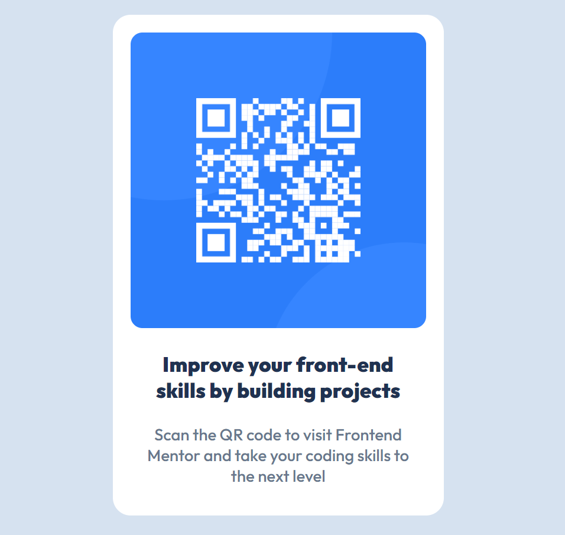

# Frontend Mentor - QR code component solution

This is a solution to the [QR code component challenge on Frontend Mentor](https://www.frontendmentor.io/challenges/qr-code-component-iux_sIO_H). Frontend Mentor challenges help you improve your coding skills by building realistic projects. 

## Table of contents

- [Overview](#overview)
  - [Screenshot](#screenshot)
  - [Links](#links)
- [My process](#my-process)
  - [Built with](#built-with)
  - [What I learned](#what-i-learned)
  - [Continued development](#continued-development)
  - [Useful resources](#useful-resources)
- [Author](#author)

## Overview

### Screenshot

### Links

- Solution URL: [Solution URL](https://github.com/DanniJK1/QR-Code-Challenge)
- Live Site URL: [Live Site URL](https://dannijk1.github.io/QR-Code-Challenge/)

## My process

### Built with

- Semantic HTML5 markup
- CSS custom properties

### What I learned

During this project, I learned how to center elements and images so they would be responsive in relation to the page. I also learned how to style elements using CSS.

### Continued development

I want to continue focusing on styling elements in such a way that is pleasing to the eye.

### Useful resources

- [w3schools CSS](https://www.w3schools.com/w3css/defaulT.asp) - This helped me learn new useful CSS concepts. I'd recommend it to anyone trying to learn CSS.

## Author

- Frontend Mentor - [@DanniJK1](https://www.frontendmentor.io/profile/DanniJK1)